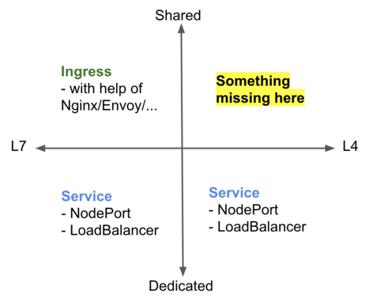
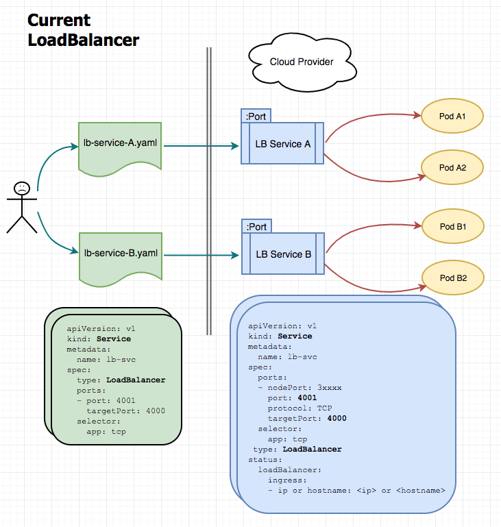
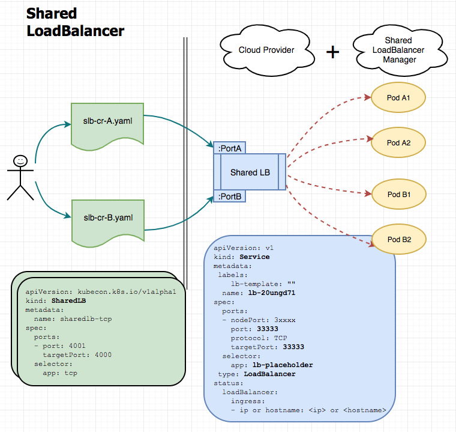

# Shared Kubernetes LoadBalancer

## Background

We know that in Kubernetes, there are generally 3 ways to expose workloads publicly:

- Service (with type `NodePort`)
- Service (with type `LoadBalancer`)
- Ingress

> kubectl proxy and similar dev/debug solutions are not counted in.

`NodePort` Service comes almost as early as born of Kubernetes. But due to limitation on ports range (30000~32767), randomness of port, and the need to expose public network of (almost) the whole cluster, `NodePort` Service is usally not considered as a good L4 solution in serious production workloads.

A viable solution today for L4 apps is `LoadBalancer` service. It's implemented differently in different Kubernetes offerings, by connecting an Kubernetes Service object with a real/virtual IaaS LoadBalancer, so that traffic going through LoadBlancer endpoint can be routed to destination pods properly.

However, in reality, L7 (e.g. HTTP) workloads are way more than raw L4 ones. So community comes up with the `Ingress` concept. `Ingress` object defines how incoming request can be routed to internal Service, and under the hood there is an ingress controller (1) dealing with `Ingress` objects, setting up mapping rules by leveraging Nginx/Envoy/etc. and also (2) (normally) exposing via `LoadBalancer` externally.

> There is a misunderstanding that using Ingress, it's also doable to manage L4 workloads. It's not true. Why Ingress can work is b/c it can tell the difference of different requests by HTTP headers, but in L4 protocol, it's only ip + port.

## Motivation

Ingress introduces a possibility which enables you to expose multiple internal L7 services through **one** public endpoint. 

And you might wonder that where's the missing piece for L4 services? This is exactly the problem we're trying to solve in this project. And following factors are considered:

- Cost
- User Experience
- Architecture Overhead
- Kubernetes Compatible
- Performance (todo)

## How It Works

Without a "SharedLoadBalancer Manager", it's N Services (of type LoadBalancer) mapped to N LoadBalancer endpoints:

With a "SharedLoadBalancer Manager", it's N SharedLB CR objects mapped to 1 LoadBalancer endpoint (on different ports):

## Links

- https://sched.co/GrUd